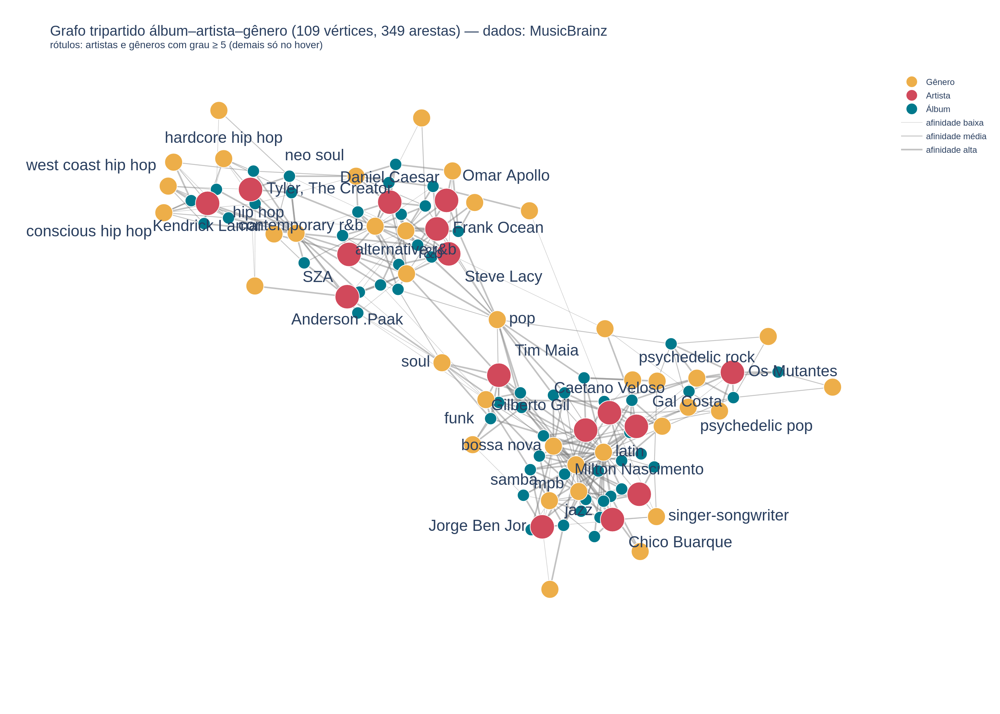

# Descoberta Musical por Grafos — Álbuns, Artistas e Gêneros

Projeto da disciplina **Teoria dos Grafos** (Faculdade de Computação e Informática, Universidade
Presbiteriana Mackenzie) — Prof. Dr. Ivan Carlos Alcântara de Oliveira.

**Integrante:** Luis Felipe Santos do Nascimento — RA 10420572

## Objetivo

O projeto modela, como um grafo, o universo de descoberta musical formado por artistas, seus
álbuns de estúdio e os gêneros musicais associados a cada um, a partir de dados públicos da API do
MusicBrainz. Este é o escopo reduzido definido após o retorno recebido na Parte 1: em vez de dados
de usuário (histórico de audição, playlists, recomendações personalizadas), o grafo passou a
conter apenas metadados públicos — artistas, álbuns e gêneros —, o que manteve o problema tratável
e os dados totalmente verificáveis a partir de uma API aberta.

## Modelo do grafo

Grafo **não orientado, com peso nas arestas** (tipo 2), tripartido entre três tipos de vértice.
Estado atual: **109 vértices** e **349 arestas**, **conexo** (uma única componente).

### Vértices

| Prefixo do rótulo | Significado | Quantidade |
|---|---|---|
| `[ART]` | Artista (dos 16 artistas semente coletados) | 16 |
| `[ALB]` | Álbum de estúdio de um dos artistas | 56 |
| `[GEN]` | Gênero musical votado pela comunidade do MusicBrainz | 37 |

### Arestas

| Ligação | Semântica | Peso |
|---|---|---|
| artista — álbum | autoria: o álbum é do artista | `0.00` (custo mínimo — o vínculo é direto) |
| artista — gênero | o artista está associado ao gênero | `1 − afinidade` |
| álbum — gênero | o álbum está associado ao gênero | `1 − afinidade` |

Não há arestas entre vértices do mesmo tipo (grafo tripartido) nem entre um artista e um álbum de
outro artista — a aresta de autoria liga cada álbum apenas ao seu próprio artista.

**Afinidade:** para cada artista/álbum, calculada a partir dos votos de gênero (`genres[].count`)
retornados pelo MusicBrainz — apenas os `top-k` gêneros mais votados (k = 5) entram como candidatos
a aresta, e a afinidade de cada um é a razão entre seus votos e os votos do gênero mais votado
daquele artista/álbum:

```
afinidade(g) = votos(g) / votos(gênero mais votado)      # em [0, 1]
```

**Peso da aresta (custo de descoberta):**

```
peso = 1 − afinidade
```

Quanto maior a afinidade (gênero mais consensual para aquele artista/álbum), menor o custo de
"descobrir" aquele gênero a partir dele — pensando em um algoritmo de caminho mínimo (ex.:
Dijkstra) como uma trilha de descoberta musical.

### Visualização



Vermelho = artista, azul-petróleo = álbum, laranja = gênero. Versão interativa (zoom, pan e hover
com o rótulo completo de cada vértice) em [`visualizacao/grafo_interativo.html`](visualizacao/grafo_interativo.html).

## Como executar

Requer Python 3.12+. A partir da raiz do repositório:

```bash
python3 -m venv .venv
source .venv/bin/activate       # Linux/macOS
pip install -r requirements.txt
```

**Aplicação de console** (menu a-j sobre `dados/grafo.txt`):
```bash
python3 src/app.py
```

**Testes automatizados** (22 testes unitários/integração, `unittest`):
```bash
python3 -m unittest discover -s testes -v
```

**Coleta dos dados brutos** na API pública do MusicBrainz (grava um JSON por artista em
`dados/brutos/`; retomável — pula artistas já coletados):
```bash
python3 coleta/coletar_musicbrainz.py
```

**Montagem do grafo** a partir dos dados brutos (gera `dados/grafo.txt`, `dados/vertices.csv` e
`dados/arestas.csv`; aceita opcionalmente o número máximo de álbuns por artista, padrão 4):
```bash
python3 coleta/montar_grafo.py [max_albuns]
```

**Visualização** (gera `visualizacao/grafo_interativo.html`, `visualizacao/grafo.png` e
`visualizacao/grafo.gexf`, este último para abrir no Gephi):
```bash
python3 visualizacao/visualizar.py
```

**Prints de teste da aplicação** (gera as capturas de tela do menu usadas no relatório):
```bash
python3 ferramentas/gerar_prints.py
```

### Menu da aplicação (`src/app.py`)

| Opção | Ação |
|---|---|
| a | Ler dados do arquivo `grafo.txt` |
| b | Gravar dados no arquivo `grafo.txt` |
| c | Inserir vértice |
| d | Inserir aresta |
| e | Remover vértice |
| f | Remover aresta |
| g | Mostrar conteúdo do arquivo |
| h | Mostrar grafo (lista ou matriz de adjacência) |
| i | Apresentar a conexidade do grafo |
| j | Encerrar a aplicação |

## Estrutura do repositório

| Caminho | Conteúdo |
|---|---|
| `src/grafo_matriz.py` | Classe `GrafoMatrizPonderado` — grafo não orientado com peso na aresta (tipo 2), matriz de adjacência |
| `src/arquivo_grafo.py` | Leitura/gravação de `dados/grafo.txt` no formato do enunciado e formatação para exibição |
| `src/app.py` | Aplicação de console com o menu a-j |
| `coleta/coletar_musicbrainz.py` | Coleta na API pública do MusicBrainz (artistas, álbuns, gêneros votados) |
| `coleta/montar_grafo.py` | Monta o grafo tripartido a partir dos dados brutos e grava `dados/` |
| `coleta/artistas_semente.txt` | Lista dos 16 artistas semente da coleta |
| `dados/grafo.txt` | Grafo no formato do enunciado (tipo, vértices, arestas) |
| `dados/vertices.csv`, `dados/arestas.csv` | Exportação tabular do grafo |
| `dados/brutos/` | Um JSON por artista, como recebido do MusicBrainz |
| `testes/` | Testes automatizados (`unittest`) de `src/` e `coleta/montar_grafo.py` |
| `visualizacao/visualizar.py` | Gera o HTML interativo (Plotly), o PNG e o GEXF (Gephi) do grafo |
| `visualizacao/grafo.png`, `grafo_interativo.html`, `grafo.gexf` | Saídas da visualização |
| `ferramentas/gerar_prints.py` | Gera as capturas de tela do menu a-j usadas no relatório |
| `ferramentas/gerar_relatorio.py` | Gera `relatorio/Relatorio_Projeto_TG_Parte2.docx` |
| `ferramentas/gerar_guia.py` | Gera `relatorio/Guia_Apresentacao.docx`, guia de apoio para a apresentação |
| `relatorio/` | Relatório, guia de apresentação e figuras usadas neles |

## Fonte dos dados

Dados coletados na API pública do [MusicBrainz](https://musicbrainz.org/) (`ws/2`, sem
autenticação, sem dados de usuário) — apenas os "core data" (artistas, álbuns/release-groups e
gêneros votados pela comunidade), que o MusicBrainz licencia sob
[CC0](https://musicbrainz.org/doc/About/Data_License) (domínio público). Data da coleta: conforme
o campo `coletado_em` de cada arquivo em `dados/brutos/*.json`.

## Relatório e vídeo

- **Relatório:** [`relatorio/Relatorio_Projeto_TG_Parte2.docx`](relatorio/Relatorio_Projeto_TG_Parte2.docx)
  ([PDF](relatorio/Relatorio_Projeto_TG_Parte2.pdf))
- **Vídeo (YouTube):** será publicado no 2º bimestre.

## Próximas etapas

Para o próximo bimestre, está prevista a implementação do algoritmo de **Dijkstra** sobre o grafo
ponderado, para calcular a "trilha de descoberta" musical de menor custo entre dois vértices
quaisquer (por exemplo, o caminho de menor custo de descoberta entre um gênero e um artista que
ainda não tem nenhum álbum associado diretamente a ele).

## Observações de ambiente

- `pip install -r requirements.txt` já inclui `numpy`, necessário internamente pelo
  `networkx.spring_layout` usado em `visualizacao/visualizar.py`.
- O `kaleido` 0.2.1 (usado para exportar `visualizacao/grafo.png`) não funciona se o `.venv`
  estiver em um caminho com espaços (ex.: `.../teoria dos grafos/...`). Se `visualizar.py` avisar
  que não conseguiu gerar o PNG, as opções são: (a) recriar o `.venv` em um caminho sem espaços, ou
  (b) abrir `visualizacao/grafo_interativo.html` no navegador e usar o botão de câmera (canto
  superior direito do gráfico) para baixar o PNG manualmente. O HTML e o GEXF são sempre gerados
  normalmente, independentemente desse problema.
